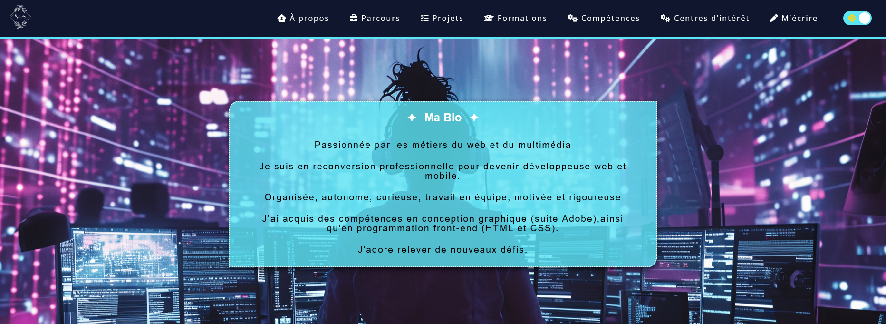

# Page - index

#### 🛠️ Procédure d'implémentation
1. Créer un fichier `index.html` avec une structure de base.
2. Ajouter la carte flip avec la photo de profil et le logo dans la section principale.
3. Intégrer les liens vers les profils sociaux dans une div dédiée.
4. Inclure les scripts `loader.js` et `slideLeftDegradeColors.js` pour les animations.
5. Ajouter les images dans le dossier `./assets/Accueil/`.
6. Tester l'animation sur différents navigateurs.

---
# Page - a-propos

#### 🛠️ Procédure d'implémentation
1. Créer un fichier `a-propos.html` avec des sections distinctes.
2. Ajouter un header avec logo, menu et switch thème.
3. Utiliser des composants interactifs comme les accordéons et les modales.
4. Ajouter des scripts pour les animations (ex : accordéons, changement de thème).
5. Vérifier la compatibilité mobile.

---

#### 🖼️ Capture d'écran

<a href="./structureAccueil.md">Suivant</a>

