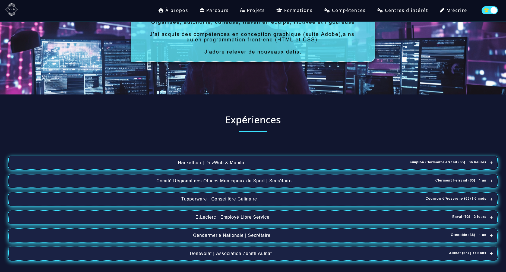
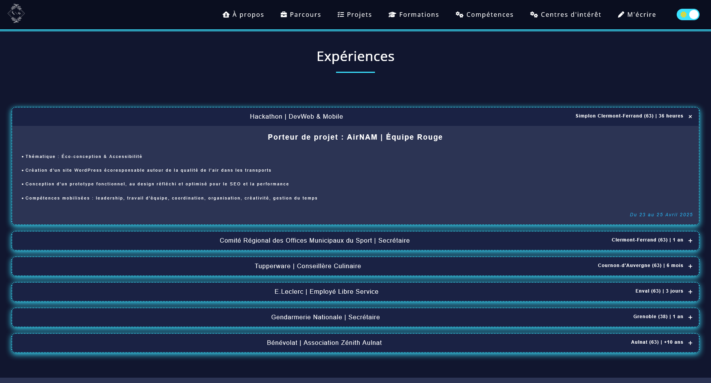
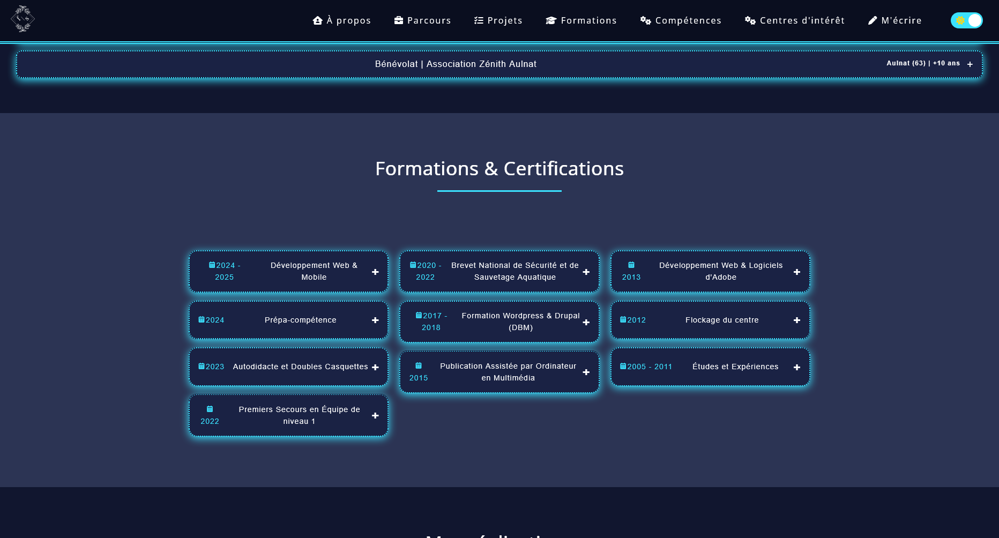
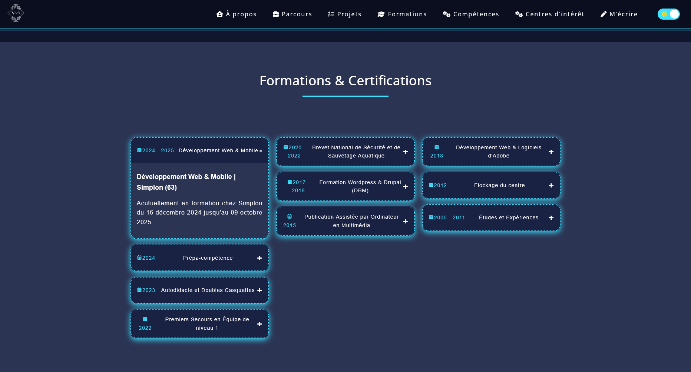
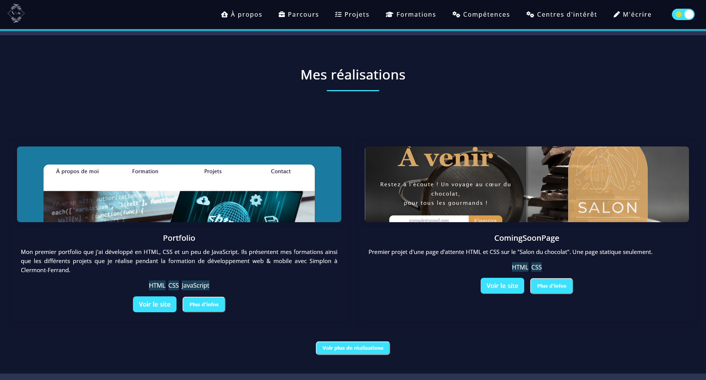
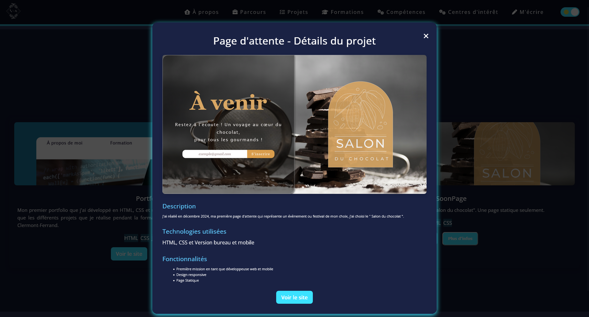
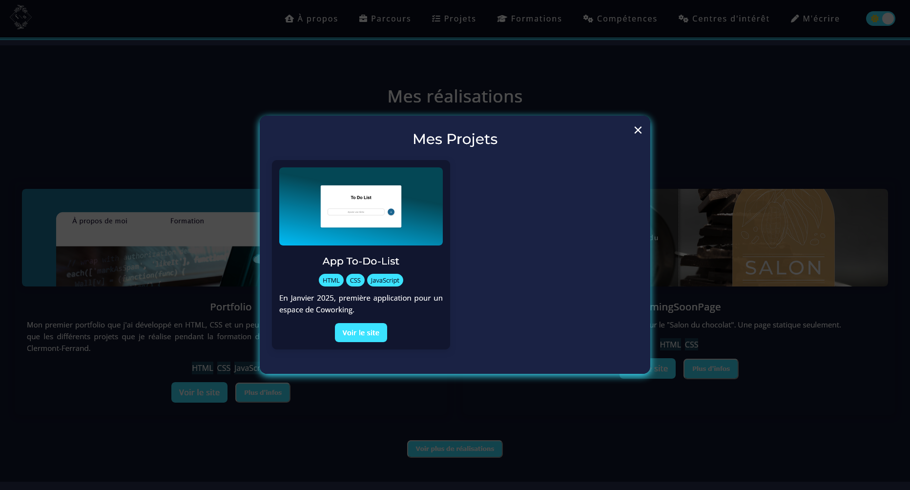
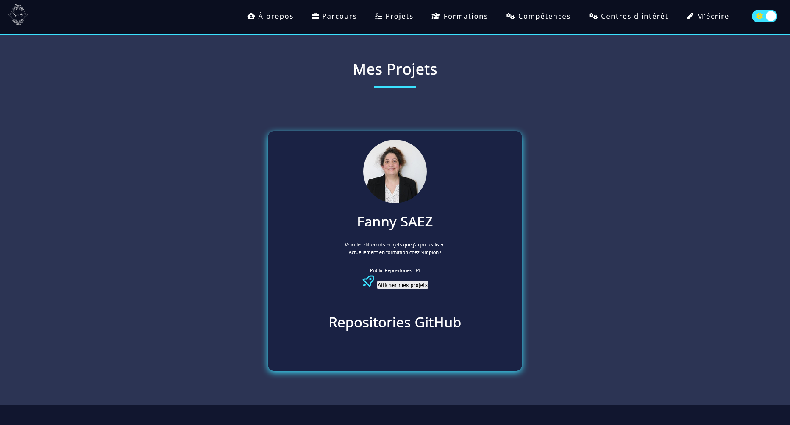
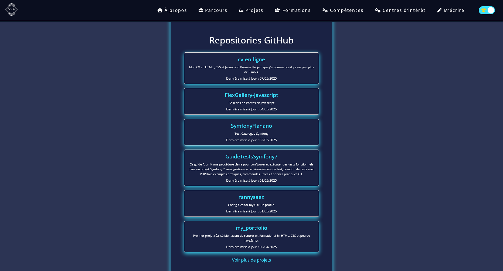

### 2. Page détaillée (a-propos.html)
Cette page est divisée en plusieurs sections :
- **Header** : Logo, menu de navigation responsive, sélecteur de thème
- **À propos** : Bio et motivations
- **Parcours professionnel** : Accordéon avec les expériences

- **Formations & Certifications** : Timeline interactive

- **Réalisations** : Cartes projet avec modales `popup`

- **Projets GitHub** : Connexion API pour lister les dépôts

- **Compétences** : Barres de progression et cercles
- **Centres d'intérêt** : Galerie d'images
- **Contact** : Formulaire de contact et liens

---

<a href="./fonctionnaliteJavaScript.md">Suivant</a>

