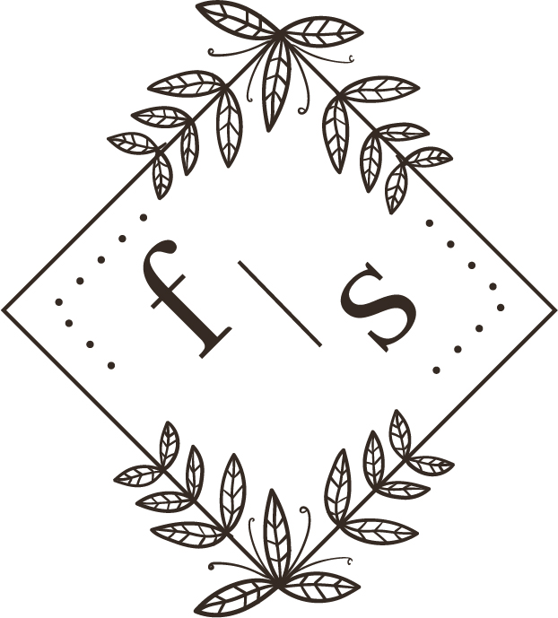
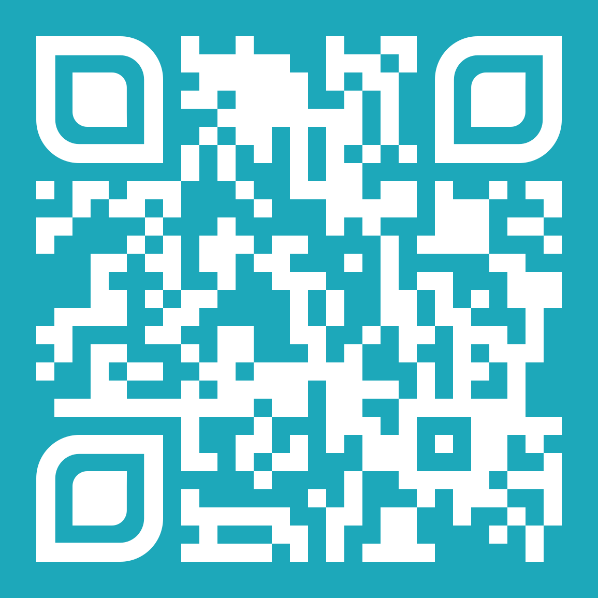

# Mon premier CV en ligne | QR Code - Accès rapide

<p align="center">
  &nbsp;&nbsp;&nbsp;&nbsp;&nbsp;&nbsp;&nbsp;&nbsp;&nbsp;&nbsp;&nbsp;&nbsp;&nbsp;&nbsp;&nbsp;&nbsp;&nbsp;&nbsp;&nbsp;&nbsp;&nbsp;&nbsp;&nbsp;&nbsp;
  
</p>

---

## 🔗 Lien vers le site
[CV en ligne | Fanny](https://fannysaez.github.io/cv-en-ligne/)

## 📋 Description du projet
Ce projet est un CV interactif en ligne présentant mon parcours, mes compétences et mes réalisations en tant que développeuse web et mobile en formation. Le site est composé de deux pages principales : une page d'accueil épurée et une page détaillée avec toutes les informations de mon parcours professionnel.

## 📱 Responsive Design
Le site est conçu pour s'adapter à toutes les tailles d'écran :
- **Desktop** : Affichage complet avec animations
- **Tablette** : Ajustement des éléments pour le tactile
- **Mobile** : Navigation simplifiée avec menu hamburger

## 🎨 Thèmes
- **Mode clair** : Design lumineux pour la journée
- **Mode sombre** : Design sombre pour le soir

## 💻 Technologies utilisées
- HTML5
- CSS3
- JavaScript
- API GitHub (REST) pour lister mes dépôts publics
- Swiper.js pour les carrousels
- FormSubmit pour l'envoi du formulaire de contact
- FontAwesome pour les icônes
- Boxicons pour les icônes supplémentaires
- Google Fonts pour la typographie

## 🚀 Installation et déploiement

1. **Cloner le repository**
```bash
git clone https://github.com/fannysaez/cv-en-ligne.git
```
2. **Ouvrir le projet**
```bash
cd cv-en-ligne
```
3. **Lancer le site localement**
Ouvrir le fichier `index.html` dans un navigateur ou utiliser un serveur local (ex : Live Server dans VSCode).

``` bash
📁 Structure de mon cv en ligne
├── 📝 README.md
├── 📝 index.html
├── 📝 a-propos.html
├── 📁 css/
│   ├── 🎨 style.css
│   └── 🎨 styles.css
├── 📁 scripts/
│   ├── ⚙️ loader.js                     # Script pour le loader animé
│   ├── ⚙️ slideLeftDegradeColors.js      # Script pour l'animation de dégradé (page d'accueil uniquement)
│   └── 📁 a-propos/
│       ├── 🔧 header-buttonToggle.js     # Script pour le bouton du header (menu hamburger)
│       ├── 🔧 accordeon-experiences.js   # Script pour l'accordéon des expériences
│       ├── 🔧 accordeon-formations.js    # Script pour l'accordéon des formations & certifications
│       ├── 🔧 button-github.js           # Connexion à l'API GitHub + visionneuse du CV en PDF
│       ├── 🔧 popup.js                   # Script pour les popups de réalisations
│       ├── 🌗 theme-toggle.js            # Script pour le changement de thème
│       ├── ✨ skills-animation.js         # Script pour l'animation des compétences
│       ├── ✉️ formContact.js              # Script pour le formulaire de contact
│       ├── ✂️ truncateText.js             # Script pour tronquer le texte trop long
│       ├── 🔽 scrollDownButtonBio.js      # Script pour le bouton de défilement vers la bio
│       ├── 🖼️ galleriesImg.js             # Script pour la gestion de la galerie d'images avec un effet zoom
│       └── 🔍 zoomImg.js                 # Script pour zoomer/déplacer les images des popups de réalisations
├── 📁 assets/
│   ├── 📁 Accueil/
│   ├── 📁 a-propos/
│   │   ├── 📂 bio/
│   │   ├── 📂 realisations/
│   │   ├── 📂 centresInteret/
│   │   ├── 📂 formContact/
│   │   └── 📂 freelance/
│   ├── 📁 docs-print/                   # CV en PDF (imprimable / téléchargeable)
│   └── 📁 img/                          # QR code du projet
└── 📁 Guide-CV-en-ligne/
    ├── 📄 procedureImplantation.md
    ├── 📄 structureAccueil.md
    ├── 📄 structureApropos.md
    └── 📄 fonctionnaliteJavaScript.md
```    
---

## Documentations

<div style="padding: 10px; border: 1px solid #ddd; border-radius: 5px; background-color: #f8f8f8;">
  <h3>Documentation imprimable</h3>
  
  <details>
    <summary style="cursor: pointer; padding: 5px 10px; background-color: #e7e7e7; border-radius: 4px; display: inline-block; border: 1px solid #ccc;">
      📑 Sélectionner les documents
    </summary>
    <div style="padding: 10px; margin-top: 10px; border: 1px solid #eee; border-radius: 4px; background-color: white;">
      <ul style="list-style-type: none; padding-left: 5px;">
        <li>
          <strong>CV Alternance CDA 2026</strong><br>
          <a href="./assets/docs-print/CV Alternance CDA 2026.pdf" onclick="window.print(); return false;">🖨️CV Alternance à imprimer</a>
        </li>
              <li>
          <strong>CV Complet 2026 - Fanny</strong><br>
          <a href="./assets/docs-print/CV Complet 2026 - Fanny.pdf" onclick="window.print(); return false;">🖨️ CV Complet à imprimer</a>
        </li>
      </ul>
    </div>
  </details>
</div>

---

## 📬 Contact
- Email : [M'écrire](mailto:fanny.saez.0486@gmail.com)
- LinkedIn : [Fanny Saez](https://www.linkedin.com/in/fannysaez)
- GitHub : [GitHub Fanny](https://github.com/fannysaez)

---

<p align="center">
© 2026 Fanny Saez - Tous droits réservés
</p>

---
<p align="center">
  <a href="Guide-CV-en-ligne/procedureImplantation.md">Suivant</a>
</p>